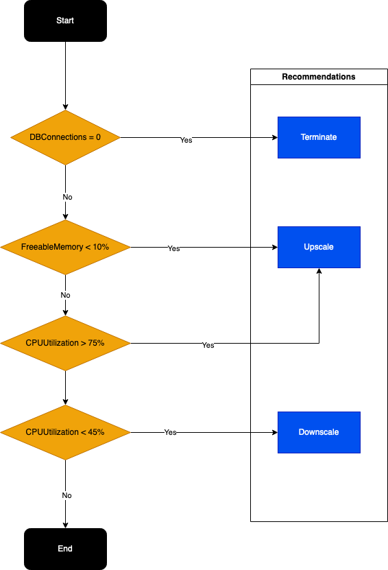

# rds-right-size

Checks for databases that are inside or outside CPU and freeable memory threshold for the defined period and creates resize proposals.



## Usage

To generate a recommendation report run:

    rds-right-size --profile profile-name --region us-east-1

To filter the resources with tags you can pass the tags option:

    rds-right-size --profile profile-name --region us-east-1 --tags tagKey=tagValue,anotherTagKey=anotherTagValue

You can also customize the CPU and Memory downsize/upsize thresholds

    rds-right-size --profile profile-name --region us-east-1 --cpu-upsize 80 --cpu-downsize 40 --mem-upsize 5

After execution it will generate a JSON file somewhat like:

```json
[
  {
    "AvailabilityZone": "us-east-1b",
    "DBInstanceArn": "arn:aws:rds:us-east-1:account:db:instancename-0",
    "DBInstanceIdentifier": "instancename-0",
    "DBInstanceClass": "db.t4g.medium",
    "Engine": "aurora-mysql",
    "EngineVersion": "8.0.mysql_aurora.3.02.2",
    "Recommendation": "DownScale",
    "Reason": "CPU is over provisioned",
    "RecommendedInstanceType": "db.t4g.small"
  }
]
```