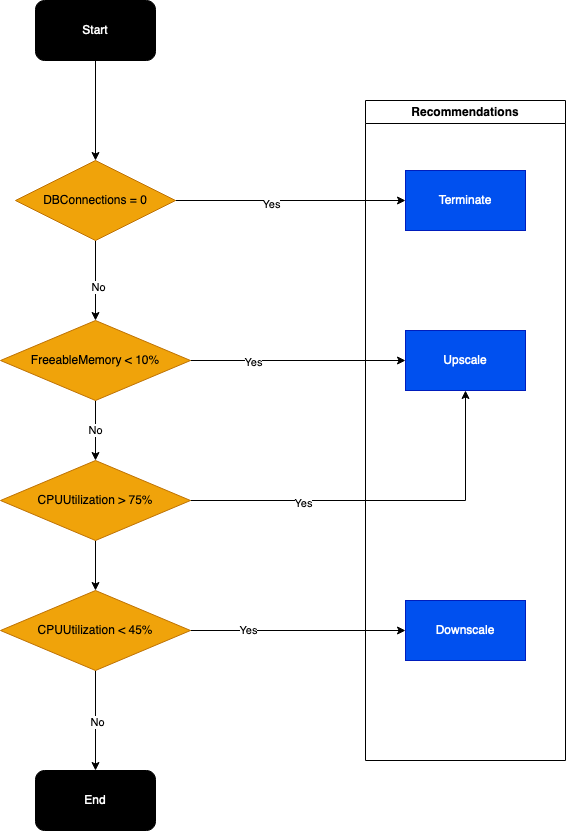

# rds-right-size

Analyzes Aurora MySQL and Aurora PostgreSQL instances against CPU and memory thresholds over a configurable lookback period and generates right-sizing recommendations.



## Features

- **Right-sizing analysis** — identifies over-provisioned (downscale), under-provisioned (upscale), and idle (terminate) Aurora instances
- **Cluster equalization** — ensures all members of an Aurora cluster share the same target instance type
- **Projected CPU** — estimates CPU utilization on the recommended instance based on vCPU ratio
- **Cost projections** — monthly and yearly savings/cost-increase estimates per instance
- **Newer generation preference** — optionally recommends newer instance generations (e.g., r6g -> r7g) with architecture-aware matching
- **Time series charts** — CPU, memory, connections, and throughput charts in TUI detail view and PNG exports
- **PNG export** — export individual instance or full cluster reports as PNG images
- **Interactive TUI** — full-featured terminal UI with configuration, results table, detail view, and built-in instance types generation

## Installation

```sh
go install github.com/luneo7/rds-right-size/cmd/rds-right-size@latest
```

Or build from source:

```sh
git clone https://github.com/luneo7/rds-right-size.git
cd rds-right-size
go build -o rds-right-size ./cmd/rds-right-size
```

## Quick Start

```sh
# Basic analysis (CLI output + JSON file)
rds-right-size --profile my-profile --region us-east-1

# Interactive TUI mode
rds-right-size --tui --region us-east-1

# Generate instance types JSON, then analyze with it
rds-right-size generate-types --region us-east-1 --output types.json
rds-right-size --region us-east-1 --instance-types types.json
```

## Usage

### CLI Mode (default)

```sh
rds-right-size --profile profile-name --region us-east-1
```

Filter by tags:

```sh
rds-right-size --region us-east-1 --tags env=prod,team=platform
```

Custom thresholds and options:

```sh
rds-right-size --region us-east-1 --cpu-upsize 80 --cpu-downsize 40 --mem-upsize 5 --stat p95 --prefer-new-gen
```

#### CLI Flags

| Flag | Short | Default | Description |
|------|-------|---------|-------------|
| `--profile` | `-p` | | AWS profile name |
| `--region` | `-r` | | AWS region to analyze |
| `--tags` | `-t` | | Tag filters (`key=value,key2=value2`) |
| `--period` | `-pe` | `30` | Lookback period in days |
| `--cpu-upsize` | `-cu` | `75` | CPU % threshold to trigger upscale |
| `--cpu-downsize` | `-cd` | `30` | CPU % threshold to trigger downscale |
| `--mem-upsize` | `-mu` | `5` | Freeable memory % threshold to trigger upscale |
| `--stat` | `-s` | `p99` | CloudWatch statistic (`p99`, `p95`, `p50`, `Average`) |
| `--instance-types` | `-i` | built-in URL | Instance types JSON (URL or local file path) |
| `--prefer-new-gen` | `-ng` | `false` | Prefer newer instance generations when scaling |
| `--tui` | | `false` | Launch interactive TUI mode |

### TUI Mode

Launch with `--tui`. CLI flags are used as default values for the configuration form:

```sh
rds-right-size --tui --profile my-profile --region us-east-1 --tags env=prod
```

The TUI has four screens:

1. **Configuration** — set analysis parameters (profile, region, tags, thresholds, statistic, etc.)
2. **Loading** — progress bar while analyzing instances
3. **Results** — sortable table of all recommendations with cost summary
4. **Detail** — per-instance breakdown with comparison cards and time series charts

#### TUI Key Bindings

| Key | Context | Action |
|-----|---------|--------|
| `tab` / `shift+tab` | Config | Navigate between fields |
| `enter` | Config | Submit / cycle selector |
| `left` / `right` | Config | Cycle selector options |
| `ctrl+r` | Config | Run analysis |
| `ctrl+u` | Config | Open instance types generation dialog |
| `up` / `down` | Results | Navigate table rows |
| `enter` | Results | View instance detail |
| `e` | Results | Export recommendations as JSON |
| `p` | Results / Detail | Export selected instance as PNG |
| `P` | Results | Export selected instance's cluster as PNG |
| `b` | Results / Detail | Go back |
| `ctrl+c` / `q` | Any | Quit |

### Generate Instance Types

The `generate-types` subcommand builds the instance types JSON file locally using public AWS pricing data and the `DescribeOrderableDBInstanceOptions` API. This is useful for keeping the types file up to date or for air-gapped environments.

#### CLI

```sh
rds-right-size generate-types --region us-east-1
```

Generate for a specific engine:

```sh
rds-right-size generate-types --region us-east-1 --engine aurora-postgresql --output pg_types.json
```

Limit to specific target regions for pricing/availability:

```sh
rds-right-size generate-types --region us-east-1 --target-regions us-east-1,us-west-2,eu-west-1
```

#### Generation Flags

| Flag | Short | Default | Description |
|------|-------|---------|-------------|
| `--region` | `-r` | *required* | Home AWS region (for `DescribeOrderableDBInstanceOptions`) |
| `--profile` | `-p` | | AWS profile name |
| `--engine` | `-e` | `both` | Engine (`both`, `aurora-mysql`, `aurora-postgresql`) |
| `--target-regions` | `-tr` | `all` | Pricing/availability regions (comma-separated or `all`) |
| `--output` | `-o` | `aurora_instance_types.json` | Output file path |

#### TUI

From the configuration screen, press `ctrl+u` to open the generation dialog. It inherits the AWS region from the config form and lets you set the engine, target regions, and output file. On success the `Instance Types` field is automatically populated with the generated file path.

## AWS Permissions

### Analysis

```json
{
  "Version": "2012-10-17",
  "Statement": [
    {
      "Effect": "Allow",
      "Action": [
        "rds:DescribeDBInstances",
        "rds:DescribeDBParameters",
        "cloudwatch:GetMetricData"
      ],
      "Resource": "*"
    }
  ]
}
```

`rds:DescribeDBParameters` is optional — if unavailable, the tool falls back to built-in defaults for `max_connections`.

### Generation (additional)

```json
{
  "Action": ["rds:DescribeOrderableDBInstanceOptions"],
  "Resource": "*"
}
```

Pricing and region data is fetched from public AWS endpoints and requires no credentials.

## Output

After analysis, a JSON file is written to the current directory:

```json
[
  {
    "AvailabilityZone": "us-east-1b",
    "DBInstanceArn": "arn:aws:rds:us-east-1:account:db:instancename-0",
    "DBInstanceIdentifier": "instancename-0",
    "DBInstanceClass": "db.r6g.large",
    "Engine": "aurora-mysql",
    "EngineVersion": "8.0.mysql_aurora.3.02.2",
    "Recommendation": "DownScale",
    "Reason": "CPU is over provisioned",
    "RecommendedInstanceType": "db.r6g.medium",
    "ProjectedCPU": 45.2,
    "MonthlyApproximatePriceDiff": -120.45
  }
]
```

PNG exports are saved to the current directory and include comparison cards, cost projections, and time series charts.
